# Binary-Classification-Model-and-Deep-Neural-Network-Model
Use deep neural network to create a binary classification model to predict whether Alphabet Soup funding applicants will be successful.

Specifically, the business team has given you a CSV file containing more than 34,000 organizations that have received funding from Alphabet Soup over the years. The CSV file contains a variety of information about each business, including whether or not it ultimately became successful. With your knowledge of machine learning and neural networks, you decide to use the features in the provided dataset to create a binary classifier model that will predict whether an applicant will become a successful business.

The steps for this project are divided into the following sections:

1. Import the Data 
2. Preprocess data for a neural network model
3. Use the model-fit-predict pattern to compile and evaluate a binary classification model
4. Optimize the model


---

## Technologies

This project leverages Anaconda and JupyterLab with Python 3.9:

* [Anaconda](https://www.anaconda.com/products/individual) 

Need to import the following libraries and dependencies:

```
import pandas as pd
from pathlib import Path
import tensorflow as tf
from tensorflow.keras.layers import Dense
from tensorflow.keras.models import Sequential
from sklearn.model_selection import train_test_split
from sklearn.preprocessing import StandardScaler,OneHotEncoder

```

---

## Installation Guide

Before running the application first install the following dependencies.

1. Install [Anaconda](https://www.anaconda.com/products/individual) from link 
2. Open up GitBash(Windows) or Terminal(Mac)
3. Type ```conda update conda``` to update Conda
4. Type ```conda update anaconda``` to update Anaconda
5. Type ```conda create -n dev python=3.9 anaconda```
6. Type ```conda activate dev``` to activate conda
7. Install a dev environment kernel by typing ```python -m ipykernel install --user --name dev```
8. Install a node environment by typing ```conda install -c conda-forge nodejs```
9. Launch JupyterLab by typing ```jupyter lab```

Open a terminal window, and then activate your ```dev``` virtual environment by running the following command:
```
conda activate dev 
```
Install TensorFlow by running the following command:

```
pip install --upgrade tensorflow
```

---

## Usage

You will need to clone the repo so that you can run the application:

```
 https://github.com/locthai2002/Binary-Classification-Model-and-Deep-Neural-Network-Model.git

```

Here are some screenshots from running the application:

## Import the Data

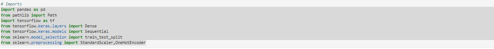

## Preprocess data for a neural network model

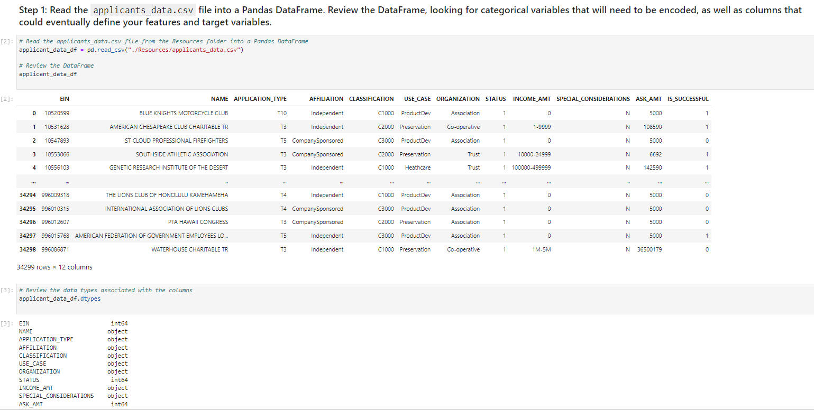
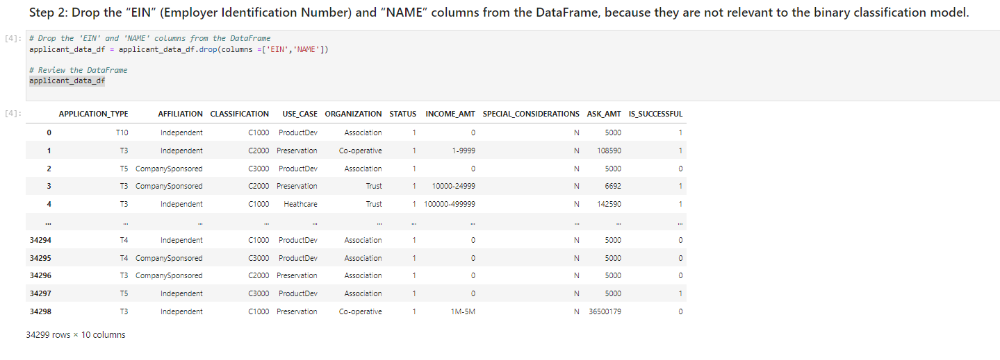
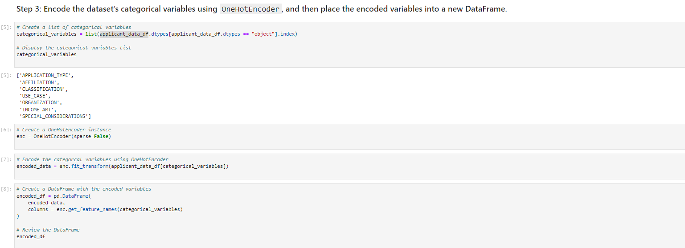
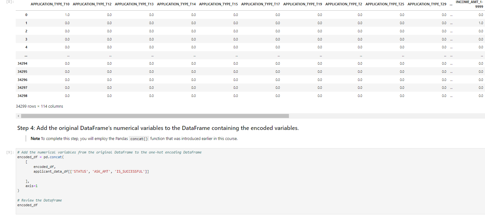
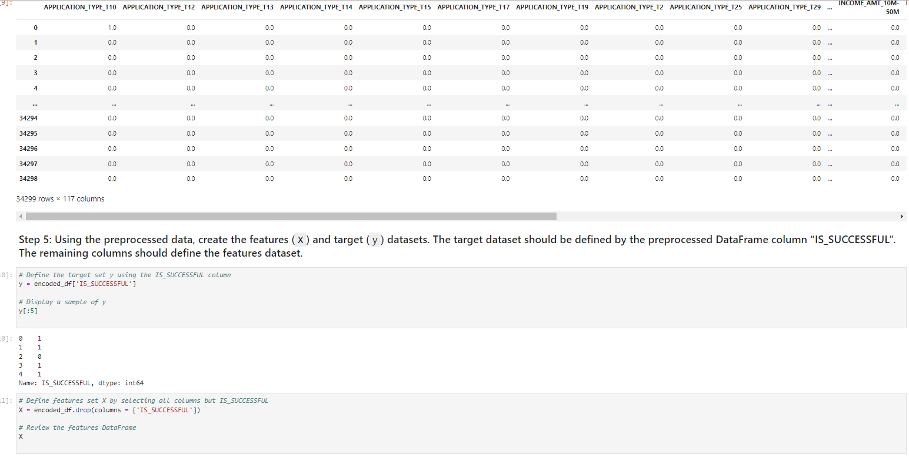
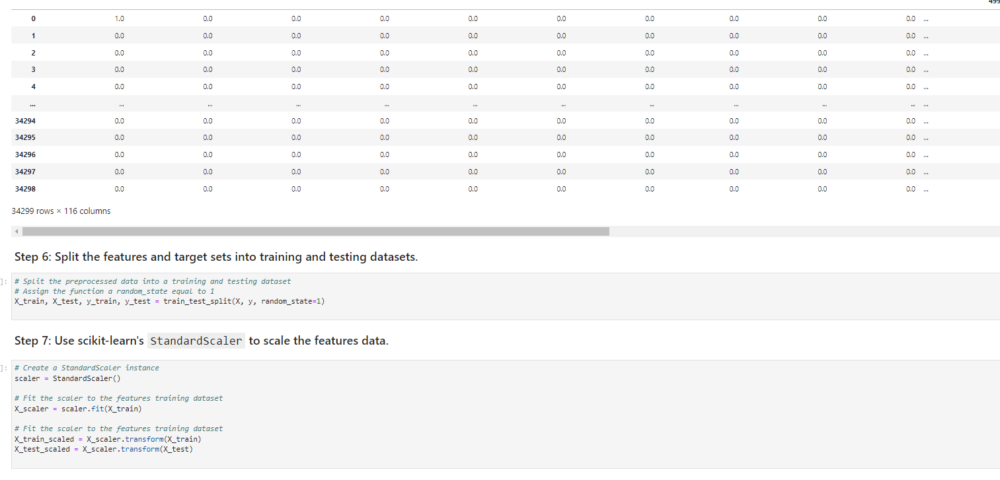

## Use the model-fit-predict pattern to compile and evaluate a binary classification model

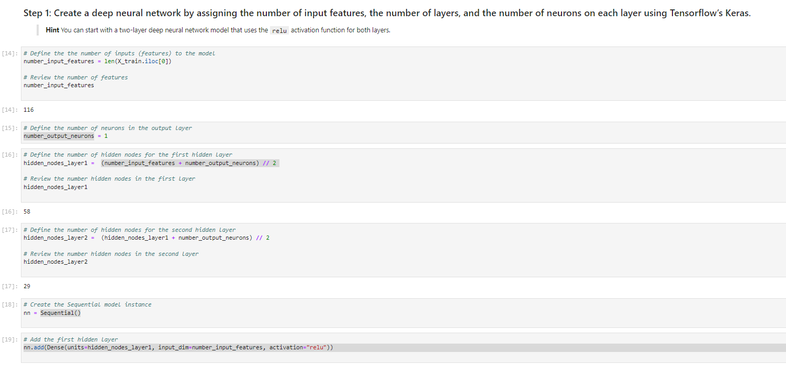
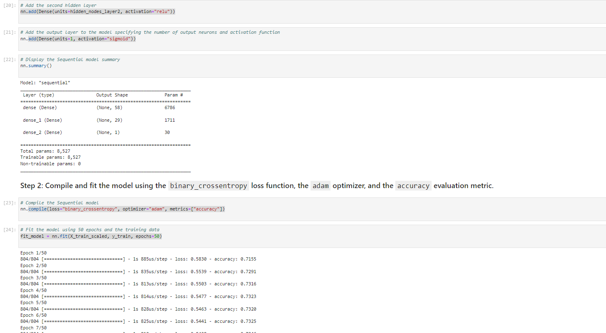
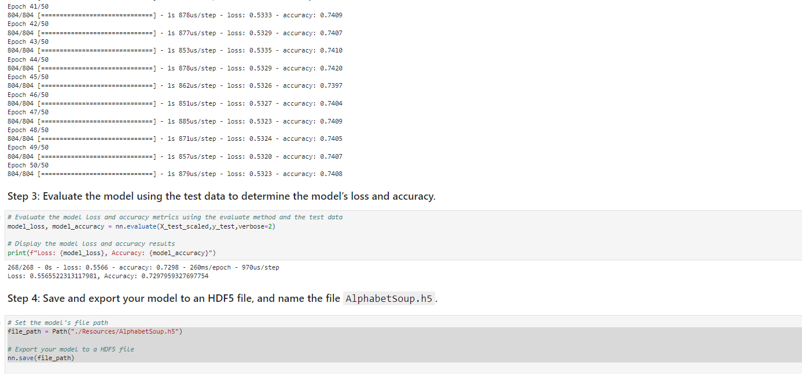

## Optimize the model

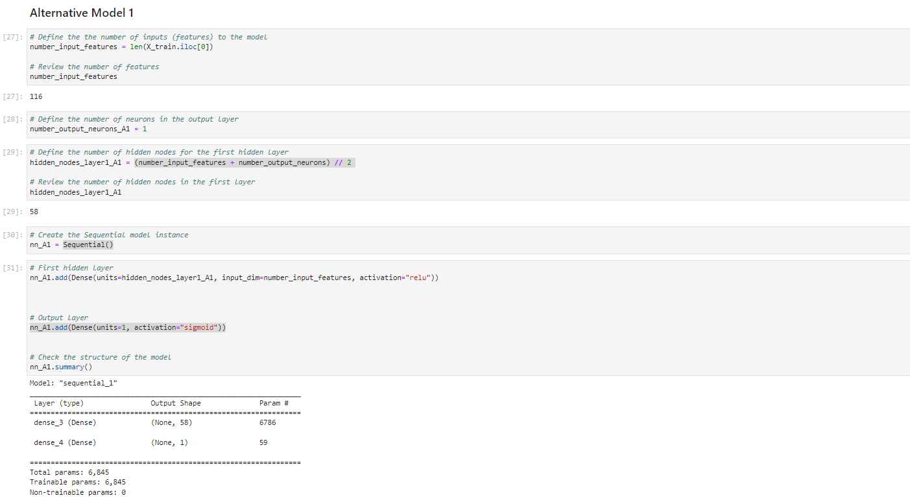
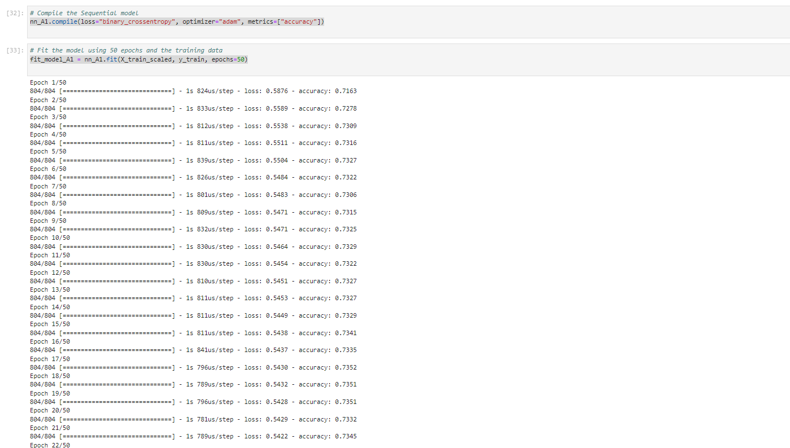
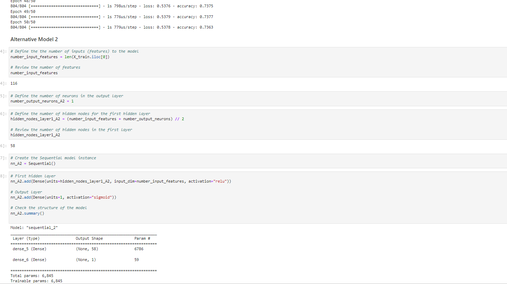
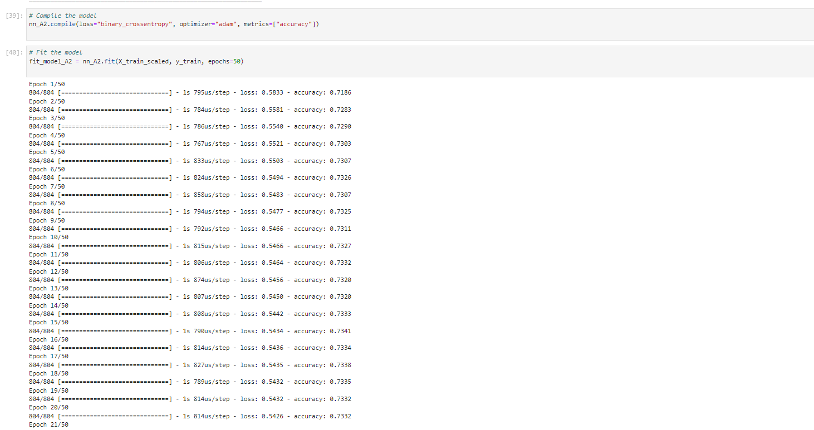
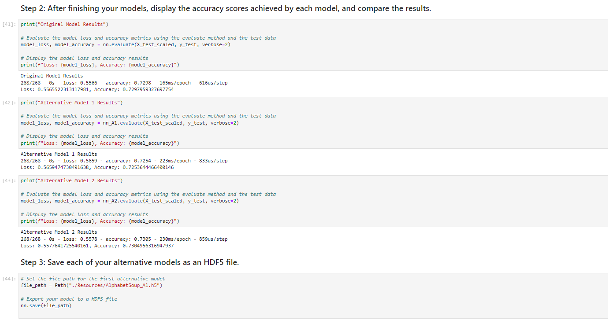


---

## Contributors

Loc Thai -- www.linkedin.com/in/loc-thai-69b8a2141
Phone: 415.400.9998

---

## License

MIT
